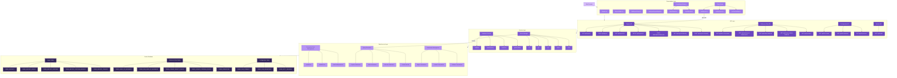

# API Architecture Diagram

```mermaid
flowchart TD
    classDef client fill:#D6BCFA,color:#44337A,stroke:#805AD5,stroke-width:1px
    classDef component fill:#9F7AEA,color:white,stroke:#805AD5,stroke-width:1px
    classDef api fill:#6B46C1,color:white,stroke:#4C1D95,stroke-width:2px
    classDef service fill:#805AD5,color:white,stroke:#4C1D95,stroke-width:1px
    classDef dataAccess fill:#B794F4,color:#44337A,stroke:#805AD5,stroke-width:1px
    classDef database fill:#322659,color:white,stroke:#4C1D95,stroke-width:2px

    %% Client Layer
    WebBrowser[Web Browser]:::client
    
    %% Presentation Layer - Actual Components
    subgraph PresentationLayer [Presentation Layer]
        direction TB
        %% UI Components
        Header[Header.tsx]:::component
        ReportsTable[ReportsTable.tsx]:::component
        CreateReportFlow[CreateReportFlow.tsx]:::component
        EditReportFlow[EditReportFlow.tsx]:::component
        ConfigureReportModal[ConfigureReportModal.tsx]:::component
        
        %% Sub-components
        CreateReportFlow --> Step1Modal[Step1Modal.tsx]:::component
        CreateReportFlow --> Step2Modal[Step2Modal.tsx]:::component
        
        %% Custom Hooks
        Hooks[Client Hooks]:::component
        Hooks --> UseReports[useReports.ts]:::component
        Hooks --> UseDebounce[useDebounce.ts]:::component
        Hooks --> UseCachedData[useCachedData.ts]:::component
    end
    
    %% API Layer - Actual API Routes
    subgraph APILayer [API Layer]
        direction TB
        %% Report APIs
        ReportsAPI[Reports API]:::api
        ReportsAPI --> GET_Reports[GET /api/reports]:::api
        ReportsAPI --> POST_Reports[POST /api/reports]:::api
        ReportsAPI --> GET_ReportById[GET /api/reports/:id]:::api
        ReportsAPI --> PATCH_Report[PATCH /api/reports/:id]:::api
        ReportsAPI --> Execute_Report[POST /api/reports/:id/execute]:::api
        ReportsAPI --> GET_ReportConfig[GET /api/reports/:id/config]:::api
        ReportsAPI --> POST_ReportConfig[POST /api/reports/:id/config]:::api
        
        %% Reference Data APIs
        ReferenceAPI[Reference Data API]:::api
        ReferenceAPI --> GET_LOBs[GET /api/lines-of-business]:::api
        ReferenceAPI --> GET_SubLOBs[GET /api/sub-lines-of-business/:id]:::api
        ReferenceAPI --> GET_LookupFields[GET /api/lookup-fields/:id]:::api
        ReferenceAPI --> GET_CriteriaFields[GET /api/lookup-criteria-fields/:id]:::api
        ReferenceAPI --> GET_Operators[GET /api/operators]:::api
        
        %% Configuration APIs
        ConfigAPI[Configuration API]:::api
        ConfigAPI --> GET_FileFormats[GET /api/file-formats]:::api
        ConfigAPI --> GET_FileDelimiters[GET /api/file-delimiters]:::api
        ConfigAPI --> GET_SftpServers[GET /api/sftp-servers]:::api
        
        %% System APIs
        SystemAPI[System API]:::api
        SystemAPI --> GET_Health[GET /api/health]:::api
    end
    
    %% Service Layer - Actual Services
    subgraph ServiceLayer [Service Layer]
        direction TB
        %% Database Service
        DatabaseService[Database Service]:::service
        DatabaseService --> Initialize[initialize]:::service
        DatabaseService --> ExecuteQuery[executeQuery]:::service
        DatabaseService --> ClosePool[closePool]:::service
        DatabaseService --> GetPoolStats[getPoolStats]:::service
        
        %% Cache Service
        CacheManager[Cache Manager]:::service
        CacheManager --> Set[set]:::service
        CacheManager --> Get[get]:::service
        CacheManager --> Has[has]:::service
        CacheManager --> Delete[delete]:::service
        CacheManager --> Clear[clear]:::service
    end
    
    %% Data Access Layer - Actual Implementation
    subgraph DataAccessLayer [Data Access Layer]
        direction TB
        %% Pool Management
        PoolManagement[Connection Pool Management]:::dataAccess
        PoolManagement --> CreatePool[createPool]:::dataAccess
        PoolManagement --> ValidatePool[validatePool]:::dataAccess
        PoolManagement --> StartCleanup[startCleanupInterval]:::dataAccess
        
        %% Query Execution
        QueryExecution[Query Execution]:::dataAccess
        QueryExecution --> PrepareStatement[Prepare Statement]:::dataAccess
        QueryExecution --> BindParameters[Bind Parameters]:::dataAccess
        QueryExecution --> ExecuteStatement[Execute Statement]:::dataAccess
        QueryExecution --> CacheResults[Cache Results]:::dataAccess
        
        %% Transaction Management
        TransactionManagement[Transaction Management]:::dataAccess
        TransactionManagement --> BeginTransaction[Begin Transaction]:::dataAccess
        TransactionManagement --> CommitTransaction[Commit Transaction]:::dataAccess
        TransactionManagement --> RollbackTransaction[Rollback Transaction]:::dataAccess
    end
    
    %% Database Layer - Actual Tables
    subgraph DatabaseLayer [Oracle Database]
        direction TB
        %% Report Tables
        ReportTables[Report Tables]:::database
        ReportTables --> ODER_REPORTS[ODER_REPORTS]:::database
        ReportTables --> ODER_REPORT_FIELDS[ODER_REPORT_FIELDS]:::database
        ReportTables --> ODER_REPORT_CRITERIA[ODER_REPORT_CRITERIA]:::database
        ReportTables --> ODER_REPORT_CRITERIA_GROUPS[ODER_REPORT_CRITERIA_GROUPS]:::database
        ReportTables --> ODER_REPORT_CONFIGS[ODER_REPORT_CONFIGS]:::database
        
        %% Reference Data Tables
        ReferenceTables[Reference Data Tables]:::database
        ReferenceTables --> ODER_LINES_OF_BUSINESS[ODER_LINES_OF_BUSINESS]:::database
        ReferenceTables --> ODER_SUB_LINES_OF_BUSINESS[ODER_SUB_LINES_OF_BUSINESS]:::database
        ReferenceTables --> ODER_LOOKUP_SELECT_FIELDS[ODER_LOOKUP_SELECT_FIELDS]:::database
        ReferenceTables --> ODER_LOOKUP_CRITERIA_FIELDS[ODER_LOOKUP_CRITERIA_FIELDS]:::database
        ReferenceTables --> ODER_OPERATORS[ODER_OPERATORS]:::database
        
        %% Configuration Tables
        ConfigTables[Configuration Tables]:::database
        ConfigTables --> ODER_FILE_FORMATS[ODER_FILE_FORMATS]:::database
        ConfigTables --> ODER_FILE_DELIMITERS[ODER_FILE_DELIMITERS]:::database
        ConfigTables --> ODER_SFTP_SERVERS[ODER_SFTP_SERVERS]:::database
    end
    
    %% Connections between layers
    WebBrowser --> PresentationLayer
    PresentationLayer --> APILayer
    APILayer --> ServiceLayer
    ServiceLayer --> DataAccessLayer
    DataAccessLayer --> DatabaseLayer
    
    %% Additional connections
    UseReports -- "API calls" --> ReportsAPI
    CacheManager -- "Caches" --> QueryExecution
```
