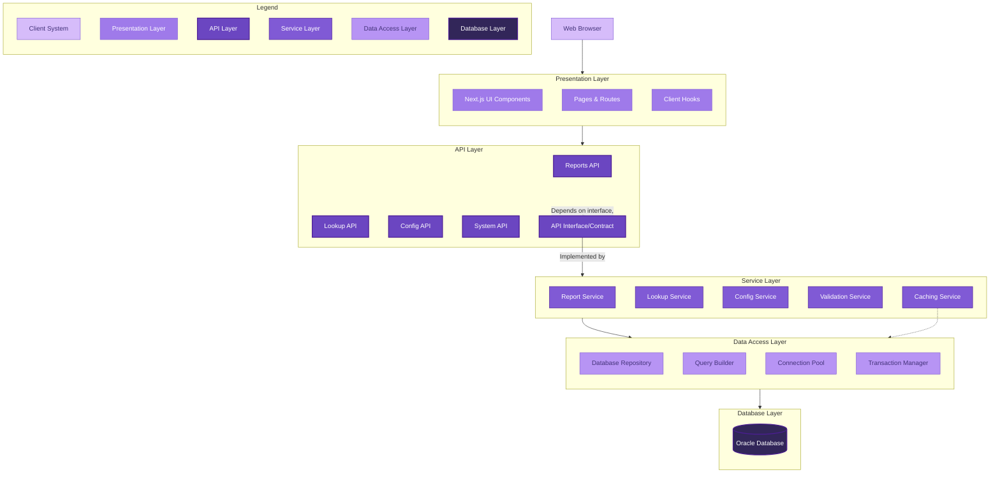

# API Architecture Diagram

```mermaid
flowchart TD
    classDef client fill:#D6BCFA,color:#44337A,stroke:#805AD5,stroke-width:1px
    classDef presentation fill:#9F7AEA,color:white,stroke:#805AD5,stroke-width:1px
    classDef api fill:#6B46C1,color:white,stroke:#4C1D95,stroke-width:2px
    classDef service fill:#805AD5,color:white,stroke:#4C1D95,stroke-width:1px
    classDef dataAccess fill:#B794F4,color:#44337A,stroke:#805AD5,stroke-width:1px
    classDef database fill:#322659,color:white,stroke:#4C1D95,stroke-width:2px

    %% Client Layer
    WebClient[Web Browser]:::client
    
    %% Presentation Layer
    subgraph PresentationLayer [Presentation Layer]
        direction TB
        NextJS[Next.js UI Components]:::presentation
        Pages[Pages & Routes]:::presentation
        ClientHooks[Client Hooks]:::presentation
    end
    
    %% API Layer - Independent
    subgraph APILayer [API Layer]
        direction TB
        ReportsAPI[Reports API]:::api
        LookupAPI[Lookup API]:::api
        ConfigAPI[Config API]:::api
        SystemAPI[System API]:::api
        
        %% API Interface
        APIInterface[API Interface/Contract]:::api
    end
    
    %% Service Layer
    subgraph ServiceLayer [Service Layer]
        direction TB
        ReportService[Report Service]:::service
        LookupService[Lookup Service]:::service
        ConfigService[Config Service]:::service
        ValidationService[Validation Service]:::service
        CacheService[Caching Service]:::service
    end
    
    %% Data Access Layer
    subgraph DataAccessLayer [Data Access Layer]
        direction TB
        DBRepository[Database Repository]:::dataAccess
        QueryBuilder[Query Builder]:::dataAccess
        ConnectionPool[Connection Pool]:::dataAccess
        TransactionManager[Transaction Manager]:::dataAccess
    end
    
    %% Database Layer
    subgraph DatabaseLayer [Database Layer]
        direction TB
        OracleDB[(Oracle Database)]:::database
    end
    
    %% Connections between layers
    WebClient --> PresentationLayer
    
    PresentationLayer --> APILayer
    
    %% API Layer's independence demonstrated by interface
    APILayer -- "Depends on interface,\nnot implementation" --> APIInterface
    APIInterface -- "Implemented by" --> ServiceLayer
    
    ServiceLayer --> DataAccessLayer
    DataAccessLayer --> DatabaseLayer
    
    %% Cache connections
    CacheService -.-> DataAccessLayer
    
    %% Legend
    subgraph Legend
        direction TB
        Client[Client System]:::client
        Presentation[Presentation Layer]:::presentation
        API[API Layer]:::api
        Service[Service Layer]:::service
        DataAccess[Data Access Layer]:::dataAccess
        Database[Database Layer]:::database
    end
```
