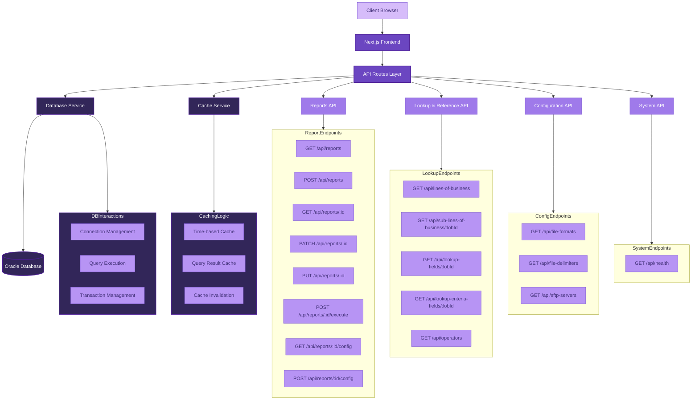

# API Architecture Diagram

```mermaid
graph TD
    classDef primary fill:#6B46C1,color:white,stroke:#4C1D95,stroke-width:2px
    classDef secondary fill:#9F7AEA,color:white,stroke:#805AD5,stroke-width:1px
    classDef data fill:#B794F4,color:#44337A,stroke:#805AD5,stroke-width:1px
    classDef client fill:#D6BCFA,color:#44337A,stroke:#805AD5,stroke-width:1px
    classDef db fill:#322659,color:white,stroke:#4C1D95,stroke-width:2px

    %% Client Layer
    Client[Client Browser]:::client
    
    %% Application Layer
    Client --> NextJS[Next.js Frontend]:::primary
    
    %% Core API Layer
    NextJS --> APIRoutes[API Routes Layer]:::primary
    
    %% Database Services
    DBService[Database Service]:::db
    CacheService[Cache Service]:::db
    APIRoutes --> DBService
    APIRoutes --> CacheService
    DBService --> Oracle[(Oracle Database)]:::db
    
    %% API Endpoints by Functional Area
    ReportsAPI[Reports API]:::secondary
    LookupAPI[Lookup & Reference API]:::secondary
    ConfigAPI[Configuration API]:::secondary
    SystemAPI[System API]:::secondary
    
    APIRoutes --> ReportsAPI
    APIRoutes --> LookupAPI
    APIRoutes --> ConfigAPI
    APIRoutes --> SystemAPI
    
    %% Report API Endpoints
    ReportsAPI --> ReportEndpoints
    subgraph ReportEndpoints
        GET_Reports[GET /api/reports]:::data
        POST_Reports[POST /api/reports]:::data
        GET_ReportById[GET /api/reports/:id]:::data
        PATCH_Report[PATCH /api/reports/:id]:::data
        PUT_Report[PUT /api/reports/:id]:::data
        POST_Execute[POST /api/reports/:id/execute]:::data
        GET_ReportConfig[GET /api/reports/:id/config]:::data
        POST_ReportConfig[POST /api/reports/:id/config]:::data
    end
    
    %% Lookup API Endpoints
    LookupAPI --> LookupEndpoints
    subgraph LookupEndpoints
        GET_LOBs[GET /api/lines-of-business]:::data
        GET_SubLOBs[GET /api/sub-lines-of-business/:lobId]:::data
        GET_LookupFields[GET /api/lookup-fields/:lobId]:::data
        GET_CriteriaFields[GET /api/lookup-criteria-fields/:lobId]:::data
        GET_Operators[GET /api/operators]:::data
    end
    
    %% Configuration API Endpoints
    ConfigAPI --> ConfigEndpoints
    subgraph ConfigEndpoints
        GET_FileFormats[GET /api/file-formats]:::data
        GET_FileDelimiters[GET /api/file-delimiters]:::data
        GET_SftpServers[GET /api/sftp-servers]:::data
    end
    
    %% System API Endpoints
    SystemAPI --> SystemEndpoints
    subgraph SystemEndpoints
        GET_Health[GET /api/health]:::data
    end
    
    %% Data Flow
    DBService --> DBInteractions[Database Operations]:::db
    subgraph DBInteractions
        Connection[Connection Management]:::data
        Queries[Query Execution]:::data
        Transactions[Transaction Management]:::data
    end
    
    CacheService --> CachingLogic[Caching Logic]:::db
    subgraph CachingLogic
        TTLCache[Time-based Cache]:::data
        QueryCache[Query Result Cache]:::data
        InvalidationLogic[Cache Invalidation]:::data
    end
```
